# 🌲 Mc_Mod_Wood_Turtle

Automatisierte Holzfarm-Turtle für **Minecraft mit CC:Tweaked**.

Dieses Projekt enthält ein Lua-Programm für eine Turtle, die automatisch eine definierte Farm abfährt, Holz abbaut, Ressourcen sammelt und diese anschließend an einer Sammelstation abgibt.

Die Turtle arbeitet am besten mit kleinen bis mittelgroßen Bäumen, wie z.B. Oak oder Spruce. Mehr hierzu unter "Benutzungshinweise".


---

## ✨ Features

* Automatische Holzernte
* Unterstützung aller Holzarten 
* Automatische Bewegung über mehrere Reihen
* Serpentinen-Fahrmuster für maximale Flächennutzung
* Automatische Rückfahrt zur Abgabestation
* Abgabe gesammelter Items über Hopper
* Brennstoffprüfung und automatisches Nachfüllen von Kohle/Saplings

---

# 📦 Voraussetzungen

Benötigt:

* Minecraft Java Edition
* CC:Tweaked
* CurseForge

Empfohlene Version:

```
Minecraft 1.20.1
CC:Tweaked 1.100+
```

---

# 🛠 Installation & Benutzung

### Modpack installieren
1. Installiere CurseForge: https://www.curseforge.com/download/app
2. Füge Minecraft ggf. als Spiel in der linken Leiste hinzu
3. Wähle dann "My Modpacks" und "Create"
4. Vergib einen Namen, wähle eine entsprechende Minecraft-Version und den Modloader "Forge" aus
5. Klicke auf "Create" und wähle das Modpack aus
6. "Add Content", suche nach "CC:Tweaked" und installiere es

### Minecraft starten
7. Starte das Modpack über den Button "Play" und erstelle eine Welt
8. Suche im Inventar nach "Turtle" und wähle eine Mining- oder Felling-Turtle aus
   9. Vorerst sollte nur eine Turtle platziert werden, später können weitere hinzukommen

### Script herunterladen & einbinden
10. Gehe auf https://github.com/anne-kmmr/Mc_Mod_Wood_Turtle, wähle "src" und anschließend "wood_turtle.lua" aus
11. Lade die Datei über das entsprechende Icon oben rechts herunter
12. Gehe zurück in CurseForge, klicke das Pack an, wähle die drei Punkte neben "Play" aus und klicke "Open Folder" an
13. Im Ordnerverzeichnis rufe nun saves/{Name_der_Welt}/computercraft/computer auf und wähle "1" aus
    14. "1" steht für die Turtle mit der ID 1, solltest du mehrere platziert haben, wähle den richtigen Ordner mittels ID-Abfrage aus
15. Füge das Script in den Ordner ein, behalte den Namen dabei bei

### Script starten
16. Wechsle in das Spiel, Rechtsklick auf die Turtle und gibt "wood_turtle" ein
17. Die Turtle fährt über die Farm und kann nach dem Durchlauf neugestartet werden

Siehe "Weitere Bilder"

---

# 🌱 Aufbau der Farm

Die Farm sollte im besten Fall so aufgebaut sein:

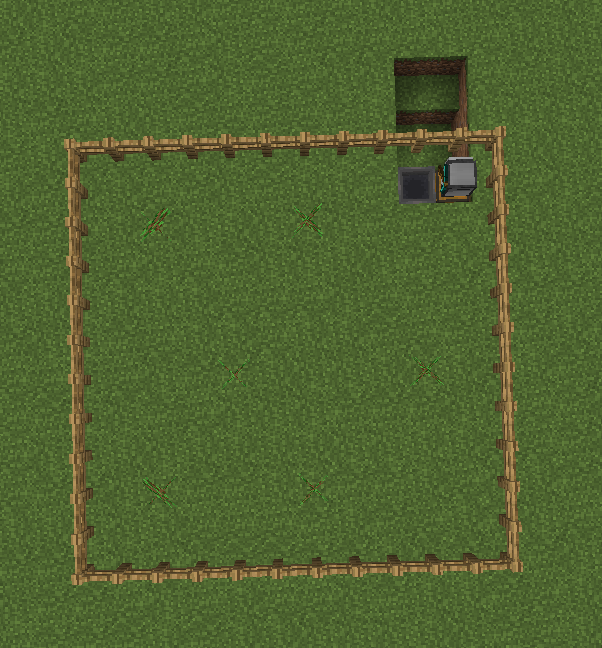

Wichtig:

* Das Feld muss frei befahrbar sein
* Zäune oder Begrenzungen müssen korrekt gesetzt sein
* Der Hopper und die Kisten müssen dort stehen, wo die Turtle ihre Items abgibt bzw. startet

Weitere Bilder siehe unter 

---

## Ablauf

1. Turtle startet an der Station nach Ausführung des Scripts
3. Fährt Reihe für Reihe ab und wendet am Ende jeder Reihe
    4. Sammelt Holz, bewegt sich (bei Bedarf) nach oben/unten und sammelt Holz am Stamm im Radius von einem Block
5. Fährt zurück zur Station
6. Gibt Items über den Hopper an Kiste ab
7. Färt auf Station, dreht sich und wartet auf ein erneutes Ausführen

---

# ⚙ Konfiguration

## Reihenanzahl

Beispiel:

```lua
local rows = 10
```

Die Turtle fährt 10 Reihen ab. Diese Zahl kann verändert werden, sollte jedoch min. 2 oder eine gerade
Zahl sein, sodass das Serpentinen-Fahrmuster auf der Farm anwendbar ist.


---

## Holzarten

Die zu sammelnden Blöcke werden über eine Liste definiert:

```lua
local wood = {
    ["minecraft:oak_log"] = true,
    ["minecraft:spruce_log"] = true,
    ["minecraft:birch_log"] = true,
    ...
}
```

Durch "false" statt "true" kann das Sammeln von bestimmten Holzarten ausgeschlossen werden.

---


# ⚠️ Benutzungshinweise

## Ausreichender Nachschub Kohle/Saplings
In der Kiste am Startpunkt müssen zu jederzeit genug Kohle als auch Saplings liegen.
Andernfalls kann es sein, dass die Turtle plötzlich stehen bleibt oder keine neuen Bäume mehr pflanzt.

## Problematik großer Bäume
Große Bäume (z.B. Jungle/Cherry) haben meist Zweige, welche vom Stamm wegführen. Die Turtle baut den Stamm
und jegliches Holz ab, welches sich im 1-Block-Radius um den Stamm herum befindet. Große Bäume könnten daher
nicht vollständig abgebaut werden. Dies sollte bei der Auswahl der Saplings als auch der ersten Bäume beachtet
werden.

## Ausrichtung der Bäume
Die Bäume dürfen nicht direkt am Zaun oder im Drehradius der Turtle stehen, da diese sonst möglicherweise 
nur den untersten Block abbaut oder sich verwirrt im Kreis dreht und in eine falsche Richtung fährt.

---

# Weitere Bilder

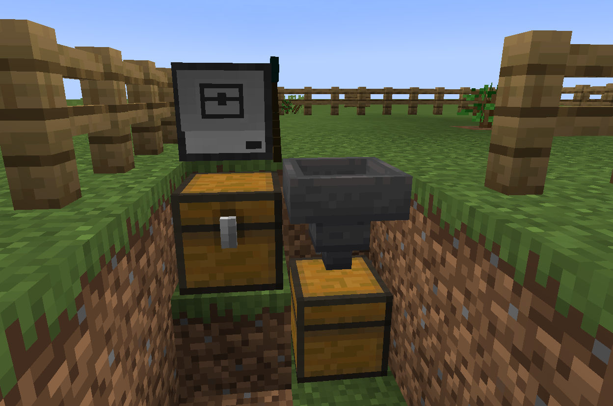

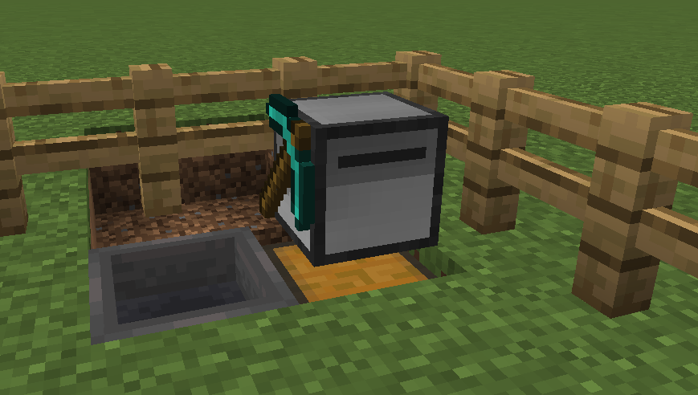

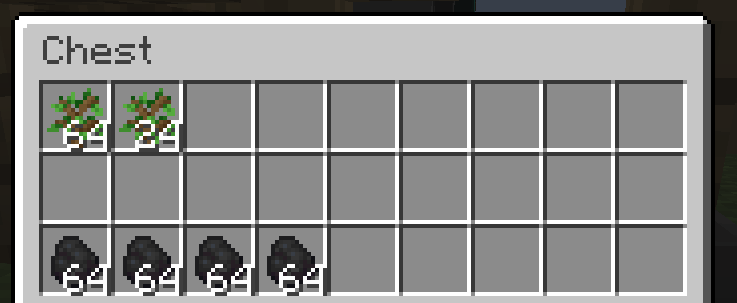

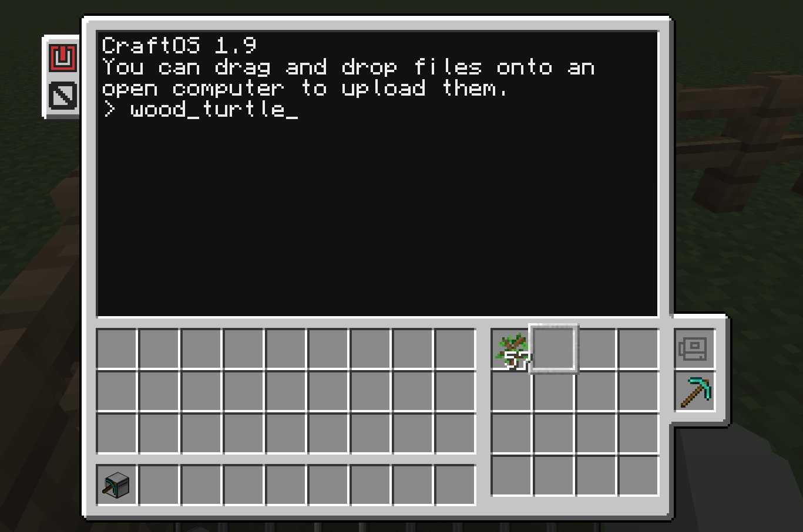

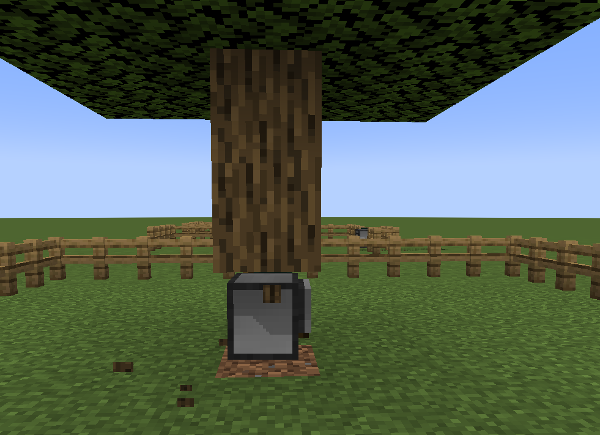

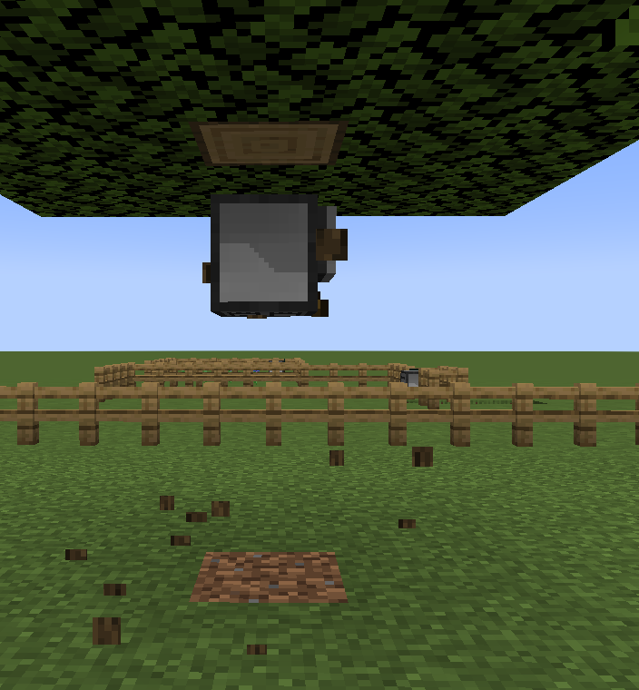

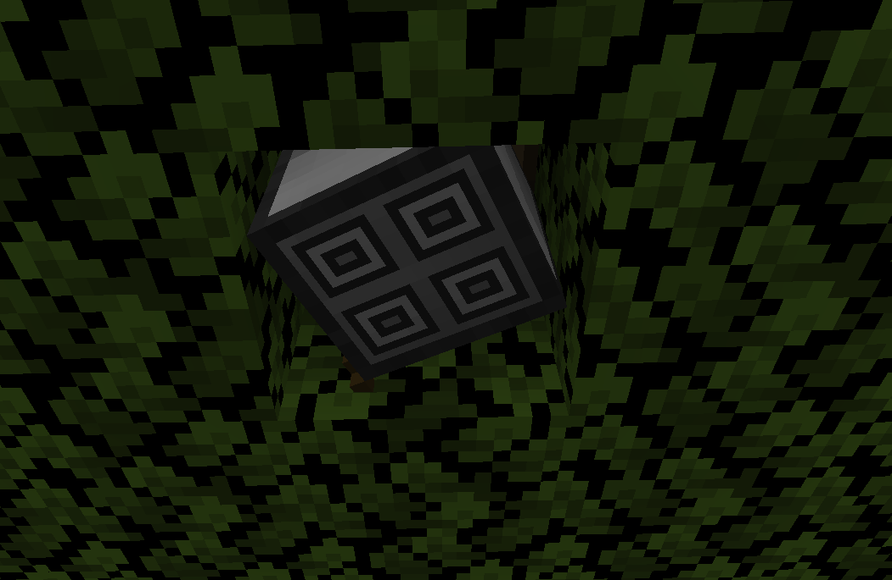

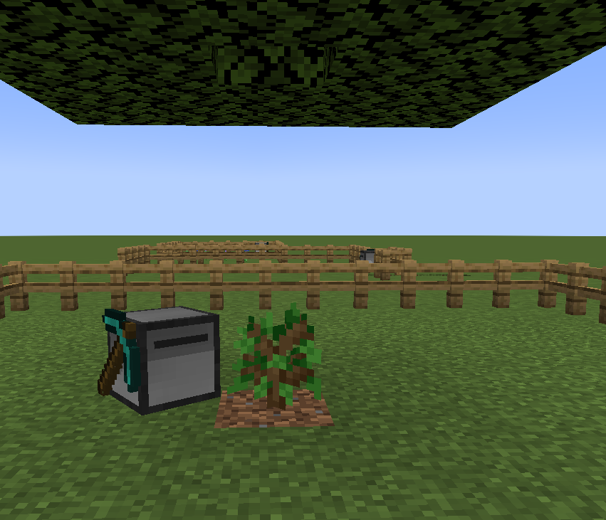

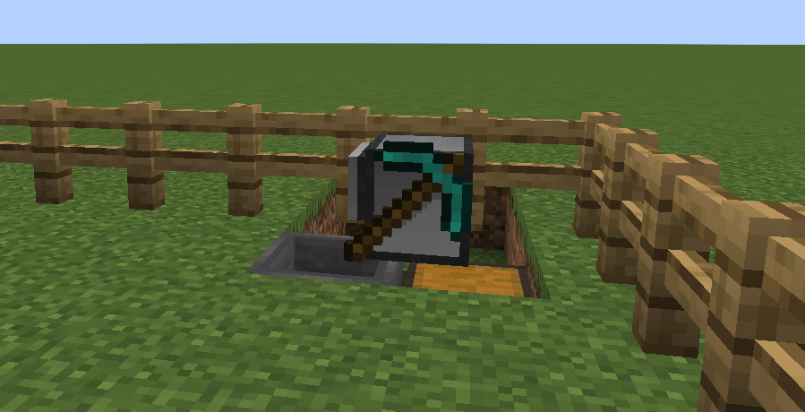

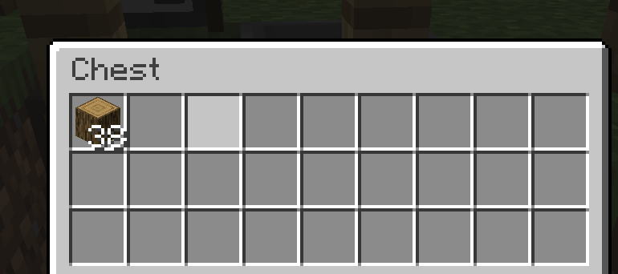

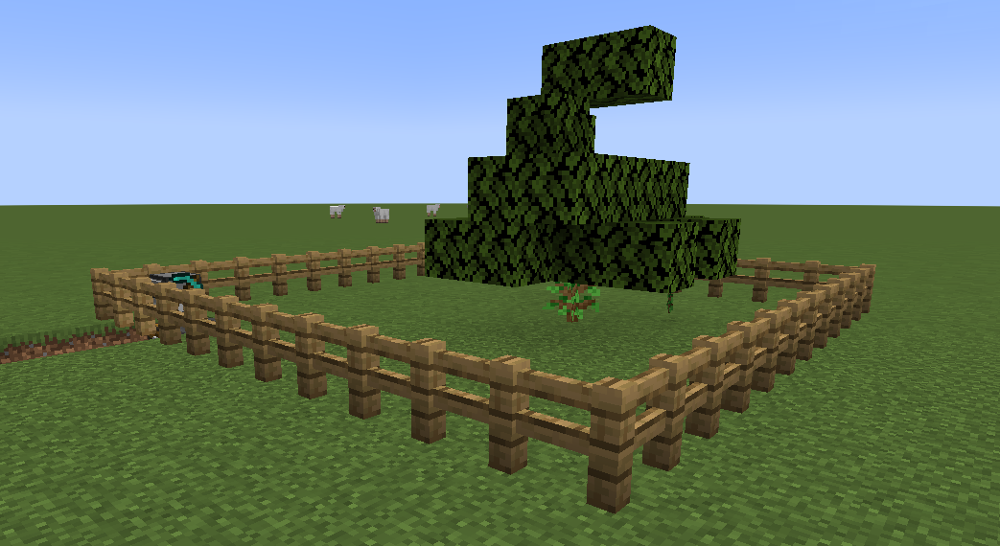


---

# ❕Hinweis

Diese Turtle wurde mithilfe der Dokumentation von TweakedCC erstellt, zu finden hier:
https://tweaked.cc/module/turtle.html

---

# 📄 Lizenz

Dieses Projekt steht unter der MIT-Lizenz.

---

# 👤 Autor

**anne-kmmr** (https://github.com/anne-kmmr)

